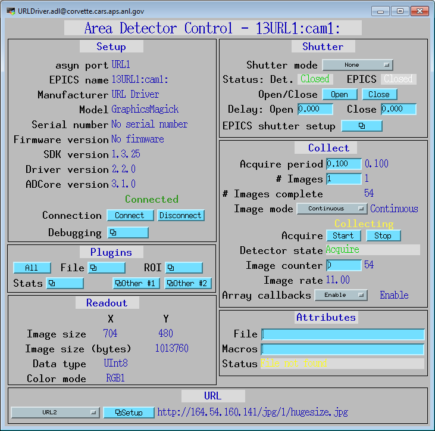
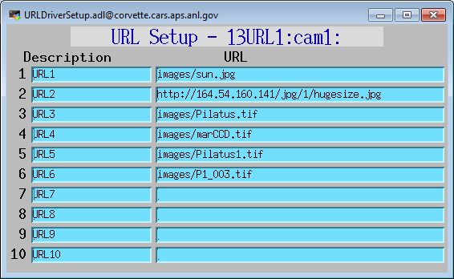
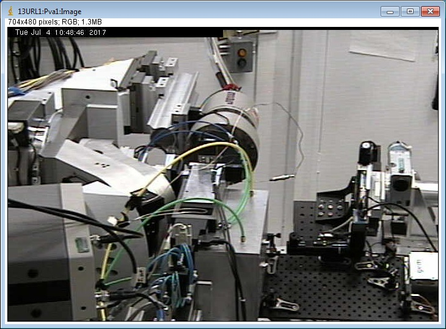

ADURL
=====
areaDetector URL driver

:author: Mark Rivers, University of Chicago

.. contents:: Contents

Introduction
------------

This is an :doc:`../index` driver for reading images from a
URL. It can be used to read images from Web cameras, `Axis video
servers`_, or simply from a disk file. It can read the images
using either `GraphicsMagick`_ or `Curl`_ (if compiled with the
WITH_CURL=YES option on CONFIG_SITE and toggling the UseCurl record)
and can thus read images encoded in any of the formats supported
by GraphicsMagick, such as JPEG, TIFF, PNG, etc.

The driver simply reads images from the specified URL at the rate
determined by the AcquirePeriod. Web cameras and Axis video servers
have a URL address from which the current image can be read. There are
often several addresses for different image sizes.

If configured correctly, curl can support both url redirection and authentication.
To avoid tedious, repetitive and error prone configuration processes, curl can
have a configuration file with all `curl options`_ in the format key = value. Example:

| CURLOPT_HTTPAUTH = 2
| CURLOPT_USERNAME = User
| CURLOPT_PASSWORD = PassWord

Each curl option must have a value adequate to the asynParamType that the option
is implemented. For example, CURLOPT_HTTPAUTH = CURLAUTH_BASIC will not work. Also,
the file only configure asyn-implemented options. Unfortunately, it does not configure
curl options that are not yet implemented in the driver.

This driver inherits from :doc:`../ADCore/ADDriver`. It implements many 
of the parameters in `asynNDArrayDriver.h`_ and in `ADArrayDriver.h`_. It also
implements a number of parameters that are specific to the URL
driver. The `URLDriver class`_ documentation describes this class in
detail.

Implementation of standard driver parameters
--------------------------------------------

The following table describes how the URL driver implements some of
the standard driver parameters.

.. cssclass:: table-bordered table-striped table-hover
.. flat-table::
  :header-rows: 2
  :widths: 20 20 60

  * - **Implementation of Parameters in asynNDArrayDriver.h and ADDriver.h,
      and EPICS Record Definitions in ADBase.template and NDFile.template**
  * - Parameter index variable
    - EPICS record name 
    - Description 
  * - ADAcquirePeriod
    - $(P)$(R)AcquirePeriod
    - This controls the period between reading images.
      The driver attempts to collect images at the rate determined by
      this value. 
    
      **NOTE: If this value is set to 0 or too small a value can
      result in the driver using 100% of the CPU and becoming unresponsive
      to EPICS.**
  * - NDFilePath
    - $(P)$(R)CfgFilePath
    - Path of directory where to find curl configuration file.
  * - NDFilePathExists
    - $(P)$(R)CfgFilePathExists_RBV
    - Is set to one if driver thinks the file exists. Is set to 0 otherwise.
  * - NDFileName
    - $(P)$(R)CfgFileName
    - Curl configuration file name. The file should contain values to be put
      into each record in the format:
      key = value
      Example:
      CURLOPT_HTTPAUTH = 2
      CURLOPT_USERNAME = User
      CURLOPT_PASSWORD = PassWord
  * - NDFullFileName
    - $(P)$(R)CfgFullFileName_RBV
    - Full filename appended with filepath.

URL driver specific parameters
------------------------------

The URL driver implements the following parameters in addition to
those in asynNDArrayDriver.h and ADDriver.h.

.. cssclass:: table-bordered table-striped table-hover
.. flat-table::
  :header-rows: 2
  :widths: 60 20 20

  * - **Parameter Definitions in URLDriver.cpp and EPICS Record Definitions
      in URLDriver.template** 
  * - Description 
    - EPICS record name 
    - EPICS record type 
  * - The name of the URL to read images from. There are 10
      output records to control the URL name. 
    - $(P)$(R)URL[1-10], $(P)$(R)URL_RBV
    - waveform, waveform
  * - Selects which os the 10 URLs to read from. 
    - $(P)$(R)URLSelect
    - mbbo
  * - Determines if image is acquired from URL with GraphicsMagick or Curl.
    - $(P)$(R)UseCurl
    - bo
  * - Sets curl's HTTP authentication method.
    - $(P)$(R)CurlOptHTTPAuth, $(P)$(R)CurlOptHTTP_RBV
    - mbbo, mbbi
  * - Toggle curl's hostname verification in SSL certificate.
    - $(P)$(R)CurlOptSSLVerifyHost, $(P)$(R)CurlOptSSLVerifyHost_RBV
    - mbbo, mbbi
  * - Toggle curl's SSL certificate verification.
    - $(P)$(R)CurlOptSSLVerifyPerr, $(P)$(R)CurlOptSSLVerifyPeer_RBV
    - bo, bi
  * - Set curl's authentication username.
    - $(P)$(R)CurlOptUserName
    - waveform
  * - Set curl's authentication password.
    - $(P)$(R)CurlOptPassword
    - waveform
  * - Shows if driver has read permission to file.
    - $(P)$(R)CfgFileValid_RBV
    - bi
  * - $(P)$(R)CurlLoadConfig
    - Loads configuration from file in $(P)$(R)CfgFullFileName_RBV. BEWARE:
      this will probably make the setpoint and readback curl option records have
      different values. For example, if you set $(P)$(R)CurlOptHTTPAuth and then
      load a CurlConfigFile that changes it, $(P)$(R)CurlOptHTTPAuth_RBV is going
      to have a different file. Also, $(P)$(R)CurlOptUserName and
      $(P)$(R)CurlOptUserPassword are going to be set in the curl option, but there
      is no readback for them.

The URLs for Web cameras and video servers are typically long strings,
which are difficult to remember and to type. Thus, for convenience
there is an EPICS mbbo record ($(P)$(R)URLSelect) which is used to select 1 of 10 URLs.
This allows easily switching between cameras, etc. The mbbo menu
string fields (e.g. ZRST, ONST, etc.) can be edited to supply a useful
short description of each camera (e.g. "Sample camera"), and the
corresponding URL waveform record will store the actual URL. Both are
in save/restore. Note that when the mbbo menu string fields are edited
then one will need to close the main URLDriver.adl medm screen and
reopen it to see the new menu choices. This is due to restrictions in
medm and Channel Access.

Unsupported standard driver parameters
--------------------------------------

The URL driver does not support many of the standard driver parameters
because it does not provide control of image acquisition. Thus
AcquireTime, binning, region to read out, trigger modes, etc. are not
supported.

Configuration
-------------

The URL driver is created with the URLDriverConfig command, either
from C/C++ or from the EPICS IOC shell. ::

    int URLDriverConfig(const char *portName,
                    int maxBuffers, size_t maxMemory,
                    int priority, int stackSize)
      
For details on the meaning of the parameters to this function refer to
the detailed documentation on the URLDirverConfig function in the 
`URLDriver.cpp documentation`_ and in the documentation for the
constructor for the `URLDriver class`_.

Example st.cmd startup file
---------------------------

.. toctree::
   :hidden:
   
   st_cmd.rst

There is an example IOC boot directory and startup script
provided with areaDetector: :doc:`st_cmd`.

MEDM screens
------------

The following show the MEDM screens that are used to control the URL
driver. Note that the general purpose screen ADBase.adl can be used,
but it exposes many controls that are not applicable to the URL
driver, and lacks some fields that are important for the URL driver.

URLDriver.adl
~~~~~~~~~~~~~

`URLDriver.adl` is the main screen used to control the URL driver.

URLDriverSetup.adl
~~~~~~~~~~~~~~~~~~

`URLDriverSetup.adl` is the screen used to configure the mbbo menu
choices and the URL strings for up to 10 preset URLs. Note that when a
new value is entered into any of the URL string waveform records that
URL will be immediately displayed, even if it is not the URL currently
selected in the mbbo menu.

ImageJ Viewer of URL driver with Axis video server
~~~~~~~~~~~~~~~~~~~~~~~~~~~~~~~~~~~~~~~~~~~~~~~~~~

The following is an ImageJ viewer window looking at the URL driver
connected to analog camera through an Axis video server.

.. _URLDriver class: ../areaDetectorDoxygenHTML/class_u_r_l_driver.html
.. _ADArrayDriver.h: ../areaDetectorDoxygenHTML/_a_d_driver_8h.html
.. _URLDriver.cpp documentation: ../areaDetectorDoxygenHTML/_u_r_l_driver_8cpp.html
.. _asynNDArrayDriver.h: ../areaDetectorDoxygenHTML/asyn_n_d_array_driver_8h.html
.. _GraphicsMagick: http://www.graphicsmagick.org/
.. _ADDriver: ../areaDetectorDoc.html#ADDriver
.. _Axis video servers: http://www.axis.com/
.. _Curl: https://curl.se/
.. _curl options: https://curl.se/libcurl/c/curl_easy_setopt.html

